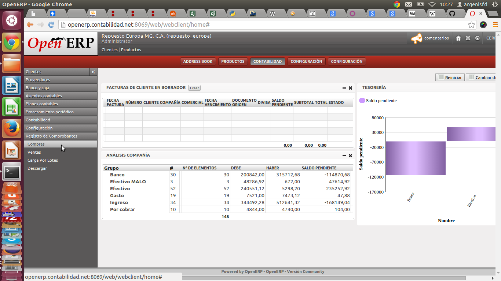
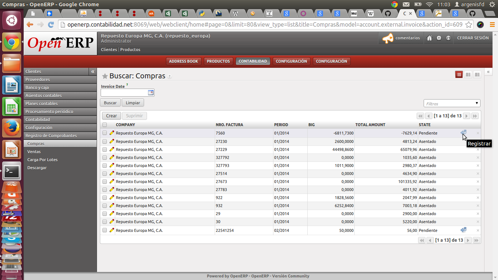
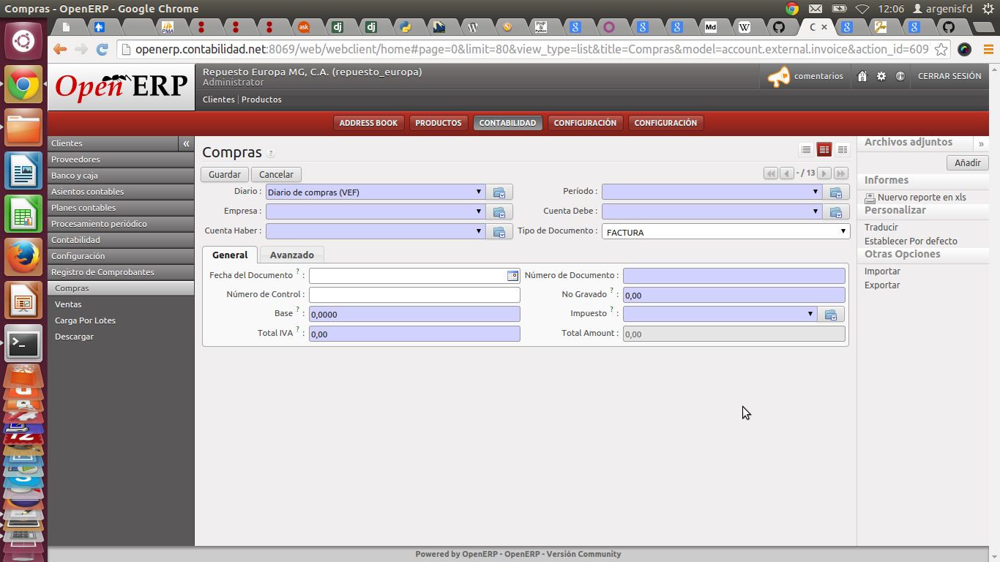
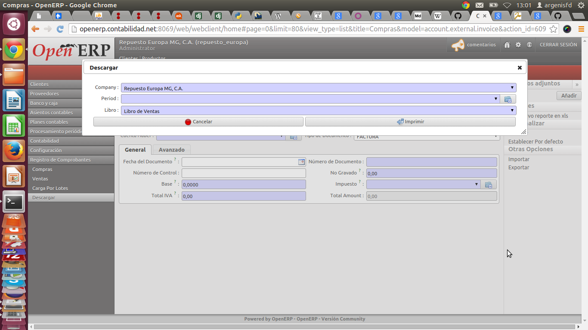

Módulo de contabilidad Externa para OpenERP
===========================================

Preámbulo
---------

El siguiente Manual de usuario está enfocado a detallar únicamente las características del módulo generado para la carga de comprobantes para OpenERP efocado para la localización venezolana.

Esta documentación se encuentra en linea en <https://github.com/argenisfd/openerp-account-external-invoice/docs/index.md>

Para saber más acerca del uso de OpenERP por favor referirse a la [Documentación Oficial de OpenERP][1] (https://doc.odoo.com/6.1/es/). 

Menú
------------------------

El menú del módulo se encuentra en `Contabilidad > Registro de Comprobantes`, allí se mostrarán las opciones de.

* Compras (#compras)
* Ventas 
* Carga por Lote
* Descargar

Compras
--------
{#compras}

El módulo de compras permite generar comprobantes de compras para registrarlos en la contabilidad de las empresas.

### Listado de Comprobantes de Compras
{#compras-listado}

En esta sección se muestra un listado de los comprobantes de compra registrados en el sistema. En la siguiente imagen se puede apreciar un ejemplo de cómo se ve esta sección.

Listado de comprobantes de compras

### Registro de Comprobantes de Compras

El formulario de resgitro compras está compuesto por los siguientes campos que acontinuación se explican:

#### Campos de los Formularios (Aplican para compra y ventas)
{#formulario}

* **Diario:** Representa el diario contable  en el cual se va a cargar el comprobante.
* **Período:** El período contable en el cual se va a cargar el nuevo comprobante.
* **Empresa:** Se debe seleccionar la empresa que aparece en el comprobante.
* **Cuenta Debe:** Se debe seleccionar la cuenta contable que se va a asentar por el Debe en el asiento contable a generar.
* **Cuenta Haber:** Se debe seleccionar la cuenta contable que se va a asentar por el Haber en el asiento contable a generar.
* **Tipo de Documento:** Se debe seleccionar el tipo de documento que se desea registrar.
* **Fecha del Documento:** En este campo se debe escribir o seleccionar del calendario la fecha impresa en el documento.
* **Número de Documento:** En este campo se debe escribir Número o código del documento si se tratara de una factura en este campo se debería escribir el número de la factura.
* **Número de Control:** (Si aplica) se debe escribir el número de control que aparece en el documento.
* **No Gravado:** Representa el monto en el documento el cual se encuenta exento de IVA. Normalmente el las facturas este monto se encuentra en el subtotal bajo el nombre de "Exento"
* **Base:** Representa el monto del documento comprobante el cual se encuantra sujeto a IVA. En las facturas se suele representar en el subtotal bajo el nombre de BIG (Base Imponible Gravada) 
* **Impuesto: ** Aquí se debe seleccionar el procentaje de impuesto que aplica en el comprobante normanente es el 12% aunque puede variar dependiendo del tipo de contribuyente.
* **Total IVA:** Este valor no debería ser modificado ya que es calculado en base a los valores previamente proporcionados, sin embargo se permite modificarlo ya que es conocido que algunas máquinas fiscales y sistemas de información no calculan bien este monto, por lo cual es permitido modificar para que dicho monto se ajuste al que se encuentra improso en el documento.
* **Total:** Este campo no es posible modificar ya que es la suma del monto exento y el Total IVA.

Vista del Formulario 

Ventas
------

Este modódulo permite registrar y gestionar los comprobantes de ventas registrados para la compañia seleccionada por defecto.

### Listado de Comprobantes de Ventas

Esta listado posee las mismas cualidades del [**Listado de Comprobantes de Compras**](#compras-listado)

### Registro de Comprobantes de Vantas

En esta sección se permite registrar los comprobantes de ventas a los clientes de la empresa, los campos del formulario a llenar se explican en [**Campos de los Formularios (Aplican para compra y ventas)**](#formulario)

Carga por Lotes
---------------

Este módulo permite hacer carga masivas al módulo de 

* nro_op: Numero de la Operación.
* fecha: Fecha del documento.
* nro_doc: Número de Documento.
* tipo_doc: Tipo de documento.
* nro_control: Número de Control.
* cliente: Nimbre del Cliente.
* cliente_tipo: Tipo del cliente (PN: persona natural, PJ: Persona Jurídica).
* cliente_rif: RIF del Cliente.
* tipo_trans: Tipo de Transacción.
* total: Total incluido IVA.
* exento: Monto Excento.
* base: Base Imponible (BIG).
* iva: Porcentaje de IVA.
* iva_monto: Monto calculado del IVA.

**Ejemlo:**

| nro_op | fecha    | nro_doc | tipo_doc | nro_control | cliente          | cliente_tipo | cliente_rif | tipo_trans   | total | exento | base | iva | iva_monto |
| ------ | -------- | ------- | -------- | ----------- | ---------------- | ------------ | ----------- | ------------ | ----- | ------ | ---- | --- | --------- |
| 1      | 16/02/14 | 55555   | FACTURA  | 00-555525   | ARGENIS FONTALVO | PN           |  V194680976 | 01-REG	      | 5000  | 500    |  0   | 12  | 0         |

No importa en el orden que aparezcan los campos, lo importante es que aparezcan todos.

Los campos que aparecen 

Descargar
----------
Este módulo permite descargar Los libros de compra y venta en un formato excel, sólo debe seleccionar la empresa de cual desea descargar el libro, el período y el tipo de libro (compra o venta) que desea descargar.

Pantalla de descarga del Libro de compra o venta

[1]: http://https://doc.odoo.com/6.1/es/  